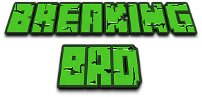
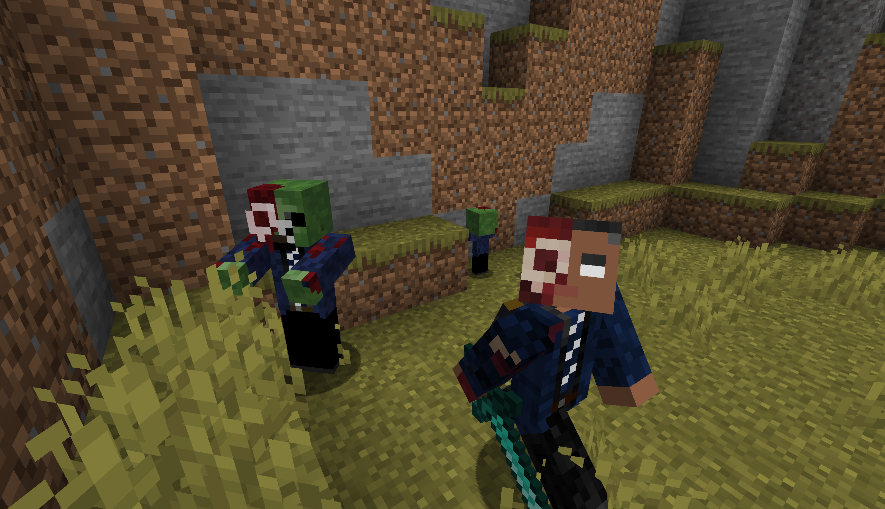
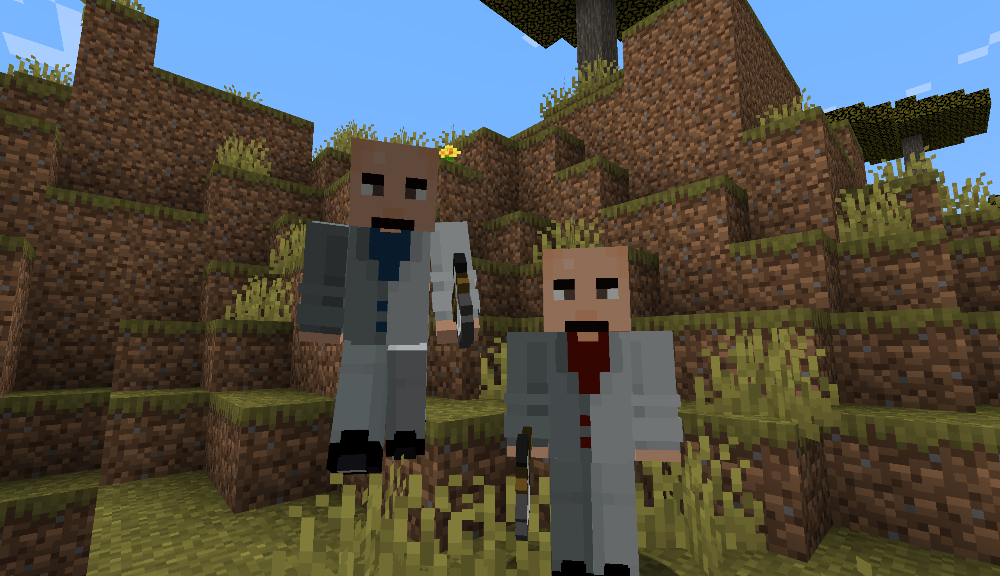

# Breaking Bad Mod for Minecraft

This mod brings the theme of the Breaking Bad TV show into the Minecraft world. It provides players with many new features that make the game more interesting and challenging.

### [中文](README.md) | English

## Start
- Require mod: Forge, Kotlin For Forge
- Download files  [Download .jar](https://github.com/ldh-star/BreakingBad-Minecraft/releases)
- CurseForge [CurseForge Home](https://www.curseforge.com/minecraft/mc-mods/breaking_bad)

#### Gus Fring
- He can trade with the player, wholesale large amounts of drugs for the player.
- He turns into Undead Gus when he dies or is struck by lightning.
- Undead Gus is a hostile boss that summons undead zombies.
  

#### Meth
- It can give you a lot of benefits, but it can lead to addiction.
- When an addiction takes hold, it produces a lot of negative effects that can be alleviated by continuing to take the drug.

#### RV
- You can find abandoned RV in tropical biome.
- You can find meth and other booty in the RV.
  

#### Other Features
- Mexican gang twins: Neutral creature, will actively attack zombies and iron Golems.
- The gold nugget gives the villagers the job of a drug dealer, who can sell drugs.
- Mercury fulminate: Right click and throw will explode.
- Cannabis: You can grow marijuana and trade it with drug dealers to get the gems. Hemp seeds can be found in weeds.
  

## Problem to be solved

- How to run 'runClient' gradle script in kotlin's mod project.
- How to use automated scripts to translate language json files into different language versions.

## License

This mod is licensed under the MIT license, see the LICENSE file for details.

## Disclaimer

This mod does not support illegal activities and is only for code learning and gaming entertainment. Please use this mod on a legally valid premise.
