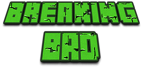
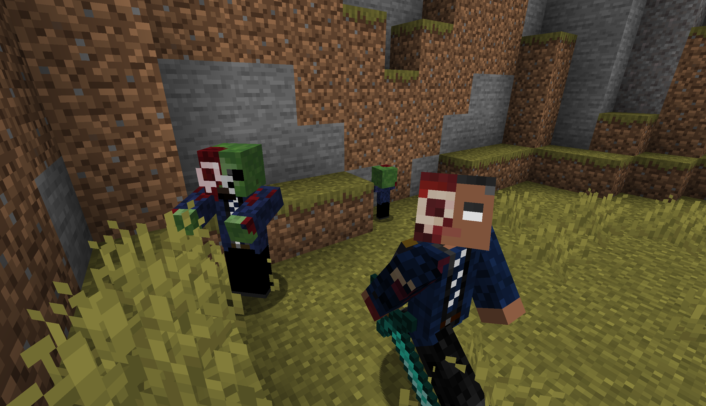

# 我的世界：绝命毒师

这个模组将绝命毒师电视剧的主题带入 Minecraft 世界。它为玩家提供了许多新的功能，使游戏变得更加有趣和具有挑战性。

### 中文 | [English](README-en.md)

## 游玩
- Download files  [点击此处下载](release/breakingbad-0.0.1-1.19.2-forge.jar)

## 特性

#### 古斯
- 可以与玩家进行交易，为玩家批发大量的毒品。
- 死亡或者被闪电击中的时候会变成亡灵古斯。
- 亡灵古斯是一种敌对boss，可以召唤亡灵僵尸。

#### 冰毒
- 吸食后可以带来大量增益效果，但会染上毒瘾。
- 当毒瘾发作的时候会产生大量的负面效果，继续服用毒品可以缓解。

#### 房车
- 你可以在热带生物群系找到被遗弃的房车。
- 房车里可以找到冰毒等战利品。

#### 其他特性
- 墨西哥黑帮双胞胎：中立生物，会主动攻击僵尸和铁傀儡。
- 黄金块可以使村民获得毒贩的职业，毒贩可以出售毒品。
- 雷酸汞：右键扔出后会爆炸。
- 大麻：你可以种植大麻并与毒贩交易来获得宝石。大麻种子可以在杂草中找到。

## 待解决的问题

- 如何在kotlin的mod项目里运行runClient的gradle脚本。
- 如何用自动化脚本将语言的json文件翻译成各种不同语言的版本。

## 许可证

这个mod是在MIT许可证下授权的，请参阅许可证文件以了解详细信息。

## 免责声明

这个mod不支持非法活动，仅用于代码学习和游戏娱乐。请在合法有效的前提下使用此mod。